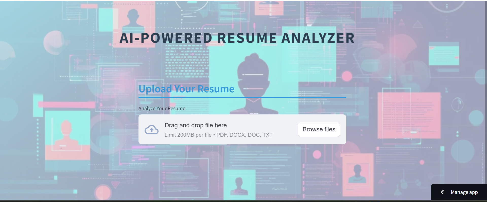
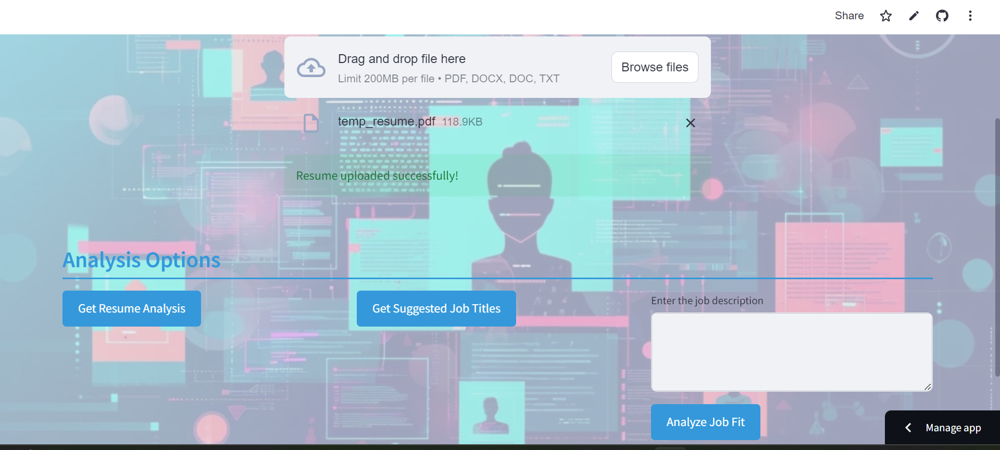

# AI-Powered Resume Analyzer

A web-based application that analyzes resumes and suggests improvements using AI. The app supports file uploads in PDF, DOCX, DOC, and TXT formats and provides feedback on resume structure and suggested job titles.

## Features
- Upload and analyze resumes (PDF, DOC, DOCX, TXT)
- Get suggestions for job titles
- Analyze job fit based on job descriptions
- User-friendly interface built with Streamlit

## Technologies
- **Frontend**: Streamlit
- **Backend**: Python
- **Model**: Gemini 1.5 pro for resume analysis

## How to Run
1. Clone this repository:
   ```bash
   git clone https://github.com/Nikhil-kolhe/Resume_analyzer.git
   ```
2. Install dependencies:
   ```bash
   pip install -r requirements.txt
   ```
3. Run the app:
   ```bash
   streamlit run app.py
   ```

## Usage
1. Upload your resume.
2. Choose an analysis option:
   - **Get Resume Analysis**: Provides feedback on your resume.
   - **Get Suggested Job Titles**: Suggests job titles based on your resume.
   - **Analyze Job Fit**: Upload a job description to analyze your fit.

## File Upload
- Supports PDF, DOCX, DOC, TXT.
- Max file size: 200MB.

## Screenshots

### Home Page


### Analysis Page
